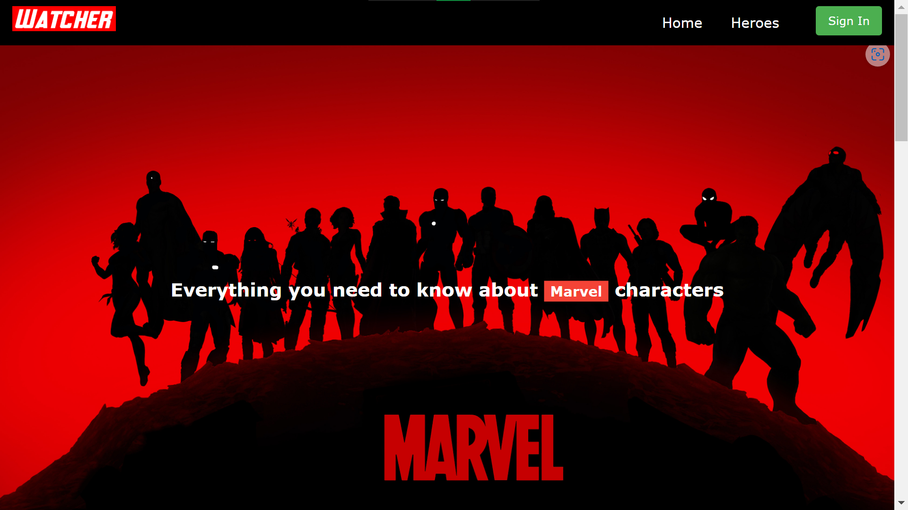
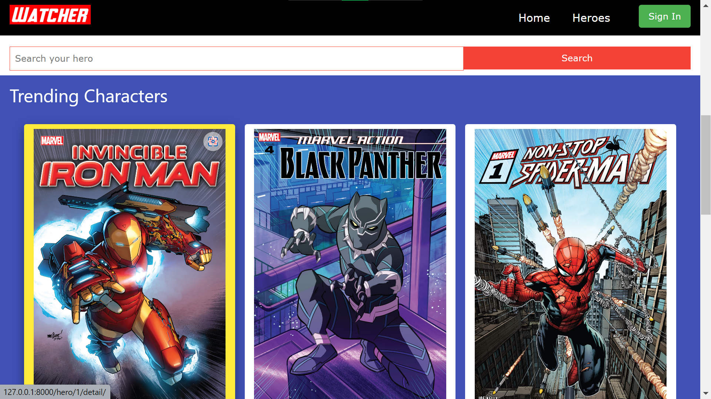
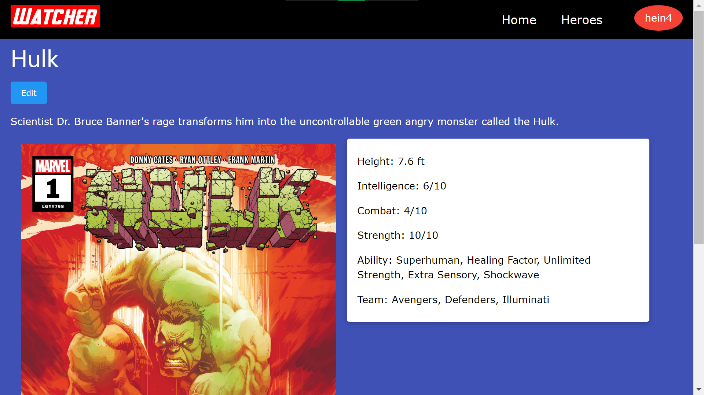

[![Stargazers][stars-shield]][stars-url]
[![Issues][issues-shield]][issues-url]
[![MIT License][license-shield]][license-url]
[![LinkedIn][linkedin-shield]][linkedin-url]

# Watcher - Marvel Characters Wiki App

**Watcher** is a website where users can view info about Marvel characters, add new characters or update data about the existing ones.

## ⚙ Built with

- [Python language](https://www.python.org/)
- [Django Framework](https://www.djangoproject.com/)
- [django-allauth](https://django-allauth.readthedocs.io/)
- [django-widget-tweaks](https://pypi.org/project/django-widget-tweaks/)

## 📌 Features

- User authentication
- CRUD using _Django Views_
- _Models_ to store data
- _ModelForm_ to collect data

## 📸 Screenshots

&nbsp;&nbsp;

&nbsp;&nbsp;

## 🗂 Contributing

Contributions are what make the open source community such an amazing place to learn, inspire, and create. Any contributions you make are **greatly appreciated**.

If you have a suggestion that would make this better, please fork the repo and create a pull request. You can also simply open an issue with the tag "enhancement".
Don't forget to give the project a star! Thanks again!

1. Fork the Project
2. Create your Feature Branch (`git checkout -b feature/AmazingFeature`)
3. Commit your Changes (`git commit -m 'Add some AmazingFeature'`)
4. Push to the Branch (`git push origin feature/AmazingFeature`)
5. Open a Pull Request

## 📜 License

Distributed under the MIT License. See `LICENSE.txt` for more information.

## 📧 Contact

[IndieCoderMM](https://github.com/indiecodermm) - [@hthantoo](https://linkedin.com/in/hthantoo) - hthant00chk@gmail.com

<!-- MARKDOWN LINKS & IMAGES -->
<!-- https://www.markdownguide.org/basic-syntax/#reference-style-links -->

[stars-shield]: https://img.shields.io/github/stars/indiecodermm/watcher-django.svg?style=for-the-badge
[stars-url]: https://github.com/indiecodermm/watcher-django/stargazers
[issues-shield]: https://img.shields.io/github/issues/indiecodermm/watcher-django.svg?style=for-the-badge
[issues-url]: https://github.com/indiecodermm/watcher-django/issues
[license-shield]: https://img.shields.io/github/license/indiecodermm/watcher-django.svg?style=for-the-badge
[license-url]: https://github.com/indiecodermm/watcher-django/blob/master/LICENSE.txt
[linkedin-shield]: https://img.shields.io/badge/-LinkedIn-black.svg?style=for-the-badge&logo=linkedin&colorB=555
[linkedin-url]: https://linkedin.com/in/hthantoo
